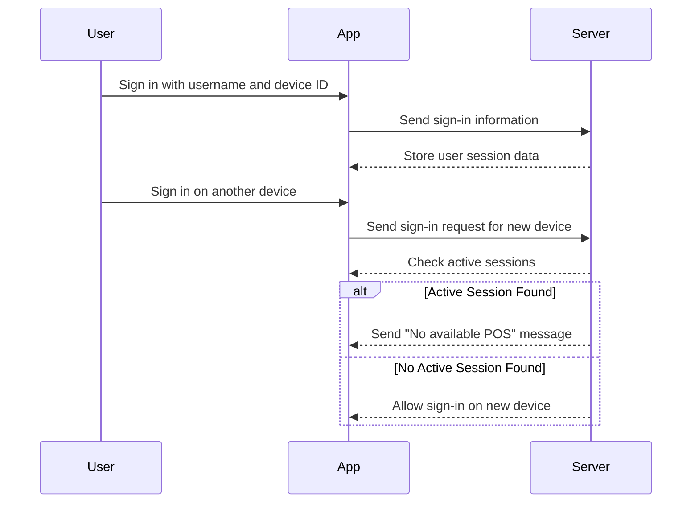
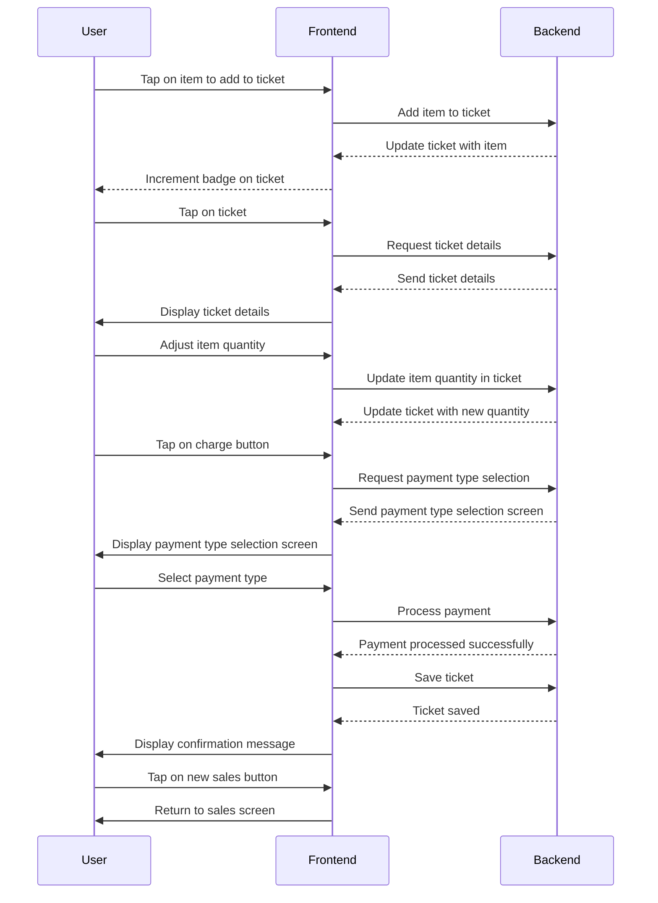

## User Active Session Check
- The user signs in to the POS app with a username and device ID. 
- The app sends the sign-in information to the server, which stores user session data. 
- If the user tries to sign in on another device, the app sends a sign-in request to the server. 
- The server checks for active sessions, and if an active session is found on another device, it triggers the message "No available POS" to inform the user to sign out from the other device. 
 


### [Database diagram on lucid.app](https://lucid.app/lucidchart/02a4c30e-69f1-4441-96b4-faabffe6f817/edit?viewport_loc=-376%2C-372%2C2828%2C1248%2C0_0&invitationId=inv_1bdeb9e8-221b-430c-9ee5-6670c27a76c2)
<!--  -->


## Epic: POS & Inventory Management System

### User Story 1:
As a super admin, I want to have a centralized platform to manage wholesalers, retailers, and their direct customers, so that I can efficiently oversee the entire system.

#### Acceptance Criteria:
1. The super admin should have access to an admin dashboard with role-based authentication.
2. The dashboard should allow the super admin to manage user acquantitys, including wholesalers, retailers, and customers.
3. The super admin should be able to view and update user details, such as contact information and access privileges.
4. The dashboard should provide analytics and reporting features to track sales, inventory, and user activities.

#### Tasks:
1. Design and develop an admin dashboard with role-based authentication.
2. Implement user management functionalities, including acquantity creation, update, and access control.
3. Integrate analytics and reporting features to provide insights on sales, inventory, and user activities.
4. Test and validate the admin dashboard to ensure its functionality and usability.

### User Story 2:
As a wholesaler, I want a system that allows me to send items bought by retailers to their respective stores, ensuring accurate inventory management.

#### Acceptance Criteria:
1. The system should provide a user-friendly interface for the wholesaler to initiate item transfers to retailers.
2. The wholesaler should be able to select specific items, quantities, and retailers for each transfer.
3. Upon successful transfer, the system should update the inventory for both the wholesaler and the retailer.
4. The retailer should receive a notification to confirm the incoming items and add them to their online store.
5. If duplicate items exist, the system should increase the quantity instead of creating duplicates.

#### Tasks:
1. Design and develop a user-friendly interface for the wholesaler to initiate item transfers.
2. Implement inventory management logic to update stock levels for both the wholesaler and the retailer.
3. Create a notification system to inform retailers about incoming items and enable them to confirm and add items to their online store.
4. Test the item transfer functionality to ensure accurate inventory management.

### User Story 3:
As a retailer, I want to have an inventory management system that allows me to perform CRUD operations on items and add regular customers to my online store.

#### Acceptance Criteria:
1. The retailer should have a user-friendly interface to manage their item inventory.
2. The interface should allow CRUD operations, enabling the retailer to add, update, and delete items.
3. The retailer should be able to set their own prices for items.
4. The system should provide a customer management feature, allowing the retailer to add regular customers to their online store.
5. Customers should be able to make orders from the online store.

#### Tasks:
1. Design and develop a user-friendly interface for retailers to manage their item inventory.
2. Implement CRUD operations for item management, including add, update, and delete functionalities.
3. Enable retailers to set their own prices for items.
4. Create a customer management feature for retailers to add regular customers to their online store.
5. Develop order management functionalities for customers to make orders from the online store.

### User Story 4:
As a customer, I want to have a mobile app that allows me to make orders from retailers' online stores and pick up the items later.

#### Acceptance Criteria:
1. The mobile app should have a user-friendly interface for customers to browse and order items.
2. Customers should be able to authenticate using their username and phone number.
3. The app should provide a list of stores available in the customer's region.
4. Customers should be able to scan a QR code in-store to download the client mobile app and find the necessary store.
5. The app should display all available items with their costs and relevant details for informed purchases.

#### Tasks:
1. Design and develop a mobile app using React Native, TypeScript, Redux, and Tailwind CSS.
2. Implement user authentication using username and phone number.
3. Integrate location-based services to provide a list of stores available in the customer's region.
4. Develop QR code scanning functionality to download the client mobile app and find the necessary store.
5. Display items with relevant details and enable customers to make orders.

These user stories, acceptance criteria, and tasks cover the main features of the point of sale and inventory management system. Please note that these are high-level examples, and we need to adapt and refine them based on our specific requirements and business processes.

### Conventional Commits Cheat Sheet

| Type     | Description                                           |
| -------- | ----------------------------------------------------- |
| feat     | A new feature                                         |
| fix      | A bug fix                                             |
| docs     | Documentation only changes                            |
| style    | Changes that do not affect the meaning of the code    |
| refactor | A code change that neither fixes a bug nor adds a feature |
| perf     | A code change that improves performance              |
| test     | Adding missing tests or correcting existing tests      |
| build    | Changes that affect the build system or external dependencies |
| ci       | Changes to our CI configuration files and scripts     |
| chore    | Other changes that don't modify src or test files      |
| revert   | Reverts a previous commit                             |

In a blog, a user can:
- read any Article
- create a Comment for any Article
- update own Comment
- update own Article

```javascript
import { defineAbility } from '@casl/ability';

export default (user) => defineAbility((can) => {
  can('read', 'Article');

  if (user.isLoggedIn) {
    can('update', 'Article', { authorId: user.id });
    can('create', 'Comment');
    can('update', 'Comment', { authorId: user.id });
  }
});
```

Git Push Local Branch to Remote
```code
git init
git add 
git commit -m "commit message"
git remote -v
git remote add origin https://github.com/muhiddinjv/ollio-server.git
git remote -v
git branch -M main
git branch -a
git fetch
git branch -a
git checkout Azimjon
git push
```


# POS IMPORTANT FEATURES
### ~~crossed out~~ = not found in Loyverse
- Restaurant POS
- eCommerce Management
- ~~Commission Management~~
- Electronic Payments
- Employee Management
- Multi-Location
- Inventory Management
- Credit Card Processing
- Retail POS
- Returns Management
- Inventory Tracking
- Barcode/Ticket Scanning
- Sales Reports
- Loyalty Program
- Payment Processing
- Ordering Automation
- Point of Sale (POS)
- Electronic Signature
- Accounting Integration
- API
- ~~Gift Card Management~~
- Discount Management
- Order Management
- Customer Accounts
- ~~Layaway Management~~
- Reporting & Statistics
- ~~Activity Dashboard~~
- ~~Promotions Management~~
- Access Controls/Permissions
- Third-Party Integrations
- Receipt Management
- ~~Invoice Management~~
- Retail Inventory Management
- ~~Customizable Reports~~
- Sales Tax Management
- Purchase Order Management
- Real Time Data
- Sales Orders
- Stock Management
- Transaction History
- CRM
- Customer Database
- ~~Billing & Invoicing~~
- Real Time Updates
- Customer History
- Sales Trend Analysis
- Alerts/Notifications
- Real Time Reporting
- Offline Access
- Barcode Recognition

In loyverse pos mobile app, on sales screen, when a user taps on an item from a list of all the items, an item quantity screen pops up where the user can manually enter the quantity of the item. When he hits the OK button, he is taken back to the sales screen with a list of items and the badge over the ticket section in the appbar gets incremented based on the quantity entered by the user. Then, the user can follow the same process to add more items to ticket. When the user, taps on the ticket, he is taken to the tickets screen where he can see the total price of each item based on its quantity and the total price of all items. When he taps on an item in the tickets screen, he is taken to the item quantity screen where he can either increment or decrement the quantity of the item. When he taps save button, he is taken back to the ticket screen which has 2 buttons on the bottom: save and charge. If the user taps the charge button, he is taken to the payment type selection screen, where there are 2 buttons; cash and card and the total amount due. When the user taps cash, he is taken to the final screen where there is only one button called new sales which takes the user all the way back to the sales screen where can repeat this whole process to make another sale and the ticket is saved in the tickets section. How does this algorithm works in the frontend and the backend?

To implement the described workflow in the Loyverse POS mobile app, both frontend and backend components need to work together. Below is an outline of how the algorithm might function:

### Frontend:
1. **Sales Screen:**
   - Displays a list of all items available for sale.
   - Allows users to tap on an item to add it to the current ticket.
   - When an item is tapped, an item quantity screen pops up.

2. **Item Quantity Screen:**
   - Allows the user to manually enter the quantity of the selected item.
   - Upon hitting the OK button, the screen closes, and the user is returned to the sales screen.
   - The badge over the ticket section in the app bar gets incremented based on the quantity entered by the user.

3. **Ticket Screen:**
   - Displays the current ticket with all added items and their quantities.
   - Shows the total price of each item based on its quantity and the total price of all items.
   - Allows users to tap on an item to adjust its quantity, leading to the item quantity screen.

4. **Payment Type Selection Screen:**
   - Appears after the user taps the "charge" button on the ticket screen.
   - Displays the total amount due and provides options for payment types (e.g., cash, card).

5. **Final Screen:**
   - Appears after the user selects a payment type (e.g., cash) and confirms payment.
   - Displays a confirmation message or receipt.
   - Provides a button to start a new sale, leading the user back to the sales screen.

### Backend:
1. **API Calls:**
   - When a user adds an item to the ticket, a request is sent to the backend to update the ticket's item list and quantities.
   - Upon adjustment of item quantity, another request updates the ticket accordingly.

2. **Ticket Management:**
   - The backend manages the state of the ticket, including items, quantities, and total price calculation.

3. **Payment Processing:**
   - When the user selects a payment type (e.g., cash), the backend processes the payment and updates relevant records (e.g., sales history, inventory).

4. **Ticket Saving:**
   - After payment confirmation, the backend saves the ticket in the tickets section for record-keeping and reporting purposes.

### Workflow Summary:
1. User interacts with the frontend by selecting items and entering quantities.
2. Frontend sends requests to the backend to update the ticket accordingly.
3. Backend processes these requests, updates the ticket state, and calculates prices.
4. Upon completion of the sale, the backend handles payment processing and ticket saving.
5. Frontend reflects relevant changes and guides the user through the sales process.

By coordinating between the frontend and backend, the Loyverse POS mobile app can provide a seamless and efficient sales experience for users.

