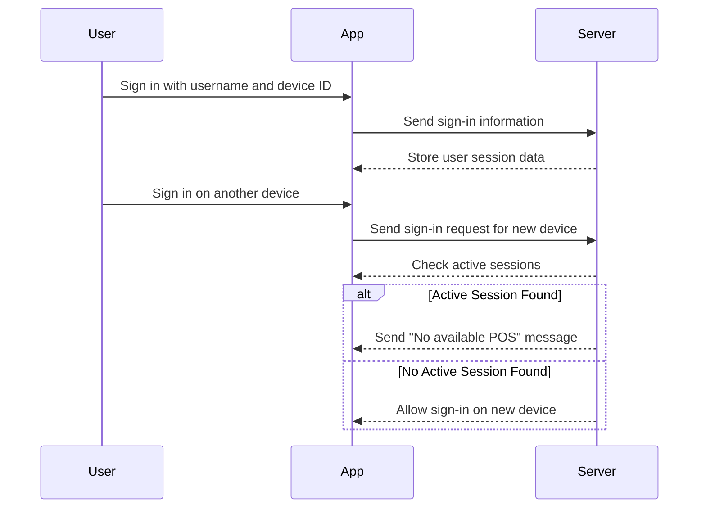
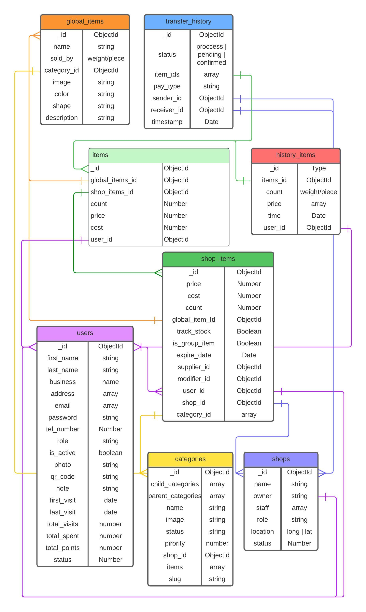
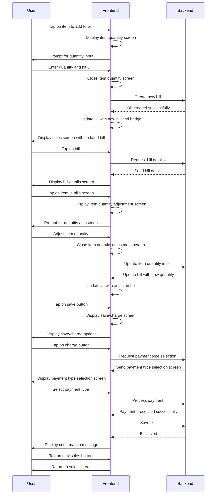

## User Active Session Check
- The user signs in to the POS app with a username and device ID. 
- The app sends the sign-in information to the server, which stores user session data. 
- If the user tries to sign in on another device, the app sends a sign-in request to the server. 
- The server checks for active sessions, and if an active session is found on another device, it triggers the message "No available POS" to inform the user to sign out from the other device. 
 


### [Database diagram on lucid.app](https://lucid.app/lucidchart/02a4c30e-69f1-4441-96b4-faabffe6f817/edit?viewport_loc=-376%2C-372%2C2828%2C1248%2C0_0&invitationId=inv_1bdeb9e8-221b-430c-9ee5-6670c27a76c2)
<!--  -->


## Epic: POS & Inventory Management System

### User Story 1:
As a super admin, I want to have a centralized platform to manage wholesalers, retailers, and their direct customers, so that I can efficiently oversee the entire system.

#### Acceptance Criteria:
1. The super admin should have access to an admin dashboard with role-based authentication.
2. The dashboard should allow the super admin to manage user acquantitys, including wholesalers, retailers, and customers.
3. The super admin should be able to view and update user details, such as contact information and access privileges.
4. The dashboard should provide analytics and reporting features to track sales, inventory, and user activities.

#### Tasks:
1. Design and develop an admin dashboard with role-based authentication.
2. Implement user management functionalities, including acquantity creation, update, and access control.
3. Integrate analytics and reporting features to provide insights on sales, inventory, and user activities.
4. Test and validate the admin dashboard to ensure its functionality and usability.

### User Story 2:
As a wholesaler, I want a system that allows me to send items bought by retailers to their respective stores, ensuring accurate inventory management.

#### Acceptance Criteria:
1. The system should provide a user-friendly interface for the wholesaler to initiate item transfers to retailers.
2. The wholesaler should be able to select specific items, quantities, and retailers for each transfer.
3. Upon successful transfer, the system should update the inventory for both the wholesaler and the retailer.
4. The retailer should receive a notification to confirm the incoming items and add them to their online store.
5. If duplicate items exist, the system should increase the quantity instead of creating duplicates.

#### Tasks:
1. Design and develop a user-friendly interface for the wholesaler to initiate item transfers.
2. Implement inventory management logic to update stock levels for both the wholesaler and the retailer.
3. Create a notification system to inform retailers about incoming items and enable them to confirm and add items to their online store.
4. Test the item transfer functionality to ensure accurate inventory management.

### User Story 3:
As a retailer, I want to have an inventory management system that allows me to perform CRUD operations on items and add regular customers to my online store.

#### Acceptance Criteria:
1. The retailer should have a user-friendly interface to manage their item inventory.
2. The interface should allow CRUD operations, enabling the retailer to add, update, and delete items.
3. The retailer should be able to set their own prices for items.
4. The system should provide a customer management feature, allowing the retailer to add regular customers to their online store.
5. Customers should be able to make orders from the online store.

#### Tasks:
1. Design and develop a user-friendly interface for retailers to manage their item inventory.
2. Implement CRUD operations for item management, including add, update, and delete functionalities.
3. Enable retailers to set their own prices for items.
4. Create a customer management feature for retailers to add regular customers to their online store.
5. Develop order management functionalities for customers to make orders from the online store.

### User Story 4:
As a customer, I want to have a mobile app that allows me to make orders from retailers' online stores and pick up the items later.

#### Acceptance Criteria:
1. The mobile app should have a user-friendly interface for customers to browse and order items.
2. Customers should be able to authenticate using their username and phone number.
3. The app should provide a list of stores available in the customer's region.
4. Customers should be able to scan a QR code in-store to download the client mobile app and find the necessary store.
5. The app should display all available items with their costs and relevant details for informed purchases.

#### Tasks:
1. Design and develop a mobile app using React Native, TypeScript, Redux, and Tailwind CSS.
2. Implement user authentication using username and phone number.
3. Integrate location-based services to provide a list of stores available in the customer's region.
4. Develop QR code scanning functionality to download the client mobile app and find the necessary store.
5. Display items with relevant details and enable customers to make orders.

These user stories, acceptance criteria, and tasks cover the main features of the point of sale and inventory management system. Please note that these are high-level examples, and we need to adapt and refine them based on our specific requirements and business processes.

### Conventional Commits Cheat Sheet

| Type     | Description                                           |
| -------- | ----------------------------------------------------- |
| feat     | A new feature                                         |
| fix      | A bug fix                                             |
| docs     | Documentation only changes                            |
| style    | Changes that do not affect the meaning of the code    |
| refactor | A code change that neither fixes a bug nor adds a feature |
| perf     | A code change that improves performance              |
| test     | Adding missing tests or correcting existing tests      |
| build    | Changes that affect the build system or external dependencies |
| ci       | Changes to our CI configuration files and scripts     |
| chore    | Other changes that don't modify src or test files      |
| revert   | Reverts a previous commit                             |

In a blog, a user can:
- read any Article
- create a Comment for any Article
- update own Comment
- update own Article

```javascript
import { defineAbility } from '@casl/ability';

export default (user) => defineAbility((can) => {
  can('read', 'Article');

  if (user.isLoggedIn) {
    can('update', 'Article', { authorId: user.id });
    can('create', 'Comment');
    can('update', 'Comment', { authorId: user.id });
  }
});
```

Git Push Local Branch to Remote
```code
git init
git add 
git commit -m "commit message"
git remote -v
git remote add origin https://github.com/muhiddinjv/ollio-server.git
git remote -v
git branch -M main
git branch -a
git fetch
git branch -a
git checkout Azimjon
git push
```


# POS IMPORTANT FEATURES
### ~~crossed out~~ = not found in Loyverse
- Restaurant POS
- eCommerce Management
- ~~Commission Management~~
- Electronic Payments
- Employee Management
- Multi-Location
- Inventory Management
- Credit Card Processing
- Retail POS
- Returns Management
- Inventory Tracking
- Barcode/Ticket Scanning
- Sales Reports
- Loyalty Program
- Payment Processing
- Ordering Automation
- Point of Sale (POS)
- Electronic Signature
- Accounting Integration
- API
- ~~Gift Card Management~~
- Discount Management
- Order Management
- Customer Accounts
- ~~Layaway Management~~
- Reporting & Statistics
- ~~Activity Dashboard~~
- ~~Promotions Management~~
- Access Controls/Permissions
- Third-Party Integrations
- Receipt Management
- ~~Invoice Management~~
- Retail Inventory Management
- ~~Customizable Reports~~
- Sales Tax Management
- Purchase Order Management
- Real Time Data
- Sales Orders
- Stock Management
- Transaction History
- CRM
- Customer Database
- ~~Billing & Invoicing~~
- Real Time Updates
- Customer History
- Sales Trend Analysis
- Alerts/Notifications
- Real Time Reporting
- Offline Access
- Barcode Recognition

in loyverse pos mobile app, on sales screen, when a user taps on an item from a list of all the items, an item quantity screen pops up where the user can manually enter the quantity of the item. When he hits the OK button, he is taken back to the sales screen with a list of items and a new bill is created in the bill section in the appbar and a badge appears over it with a number based on the quantity entered by the user. Then, the user can follow the same process to add more items to bill and each time the badge gets updated. When the user, taps on the bill, he is taken to the bills screen where he can see the total price of each item based on its quantity and the total price of all items. When he taps on an item in the bills screen, he is taken to the item quantity screen where he can either increment or decrement the quantity of the item. When he taps save button, he is taken back to the bill screen which has 2 buttons on the bottom: save and charge. If the user taps the charge button, he is taken to the payment type selection screen, where there are 2 buttons; cash and card and the total amount due. When the user taps cash, he is taken to the final screen where there is only one button called new sales which takes the user all the way back to the sales screen where can repeat this whole process to make another sale and the bill is saved in the bills section. How does this algorithm work in the front end and the back end? Be as detailed as possible. Explain everything clearly by using specific examples.

Sure, let's break down the algorithm for the Loyverse POS mobile app in both frontend and backend components.

### Frontend:

1. **Sales Screen:**
   - The user taps on an item from the list.
   - An item quantity screen appears where the user enters the quantity.
   - Example: User taps on "Coffee" and enters a quantity of 2.

2. **Item Quantity Screen:**
   - After entering the quantity and hitting OK, the user is taken back to the sales screen.
   - A new bill is created in the bill section of the app bar, and a badge appears with the quantity.
   - Example: User enters a quantity of 2 for "Coffee," and a new bill is created with a badge showing "2."

3. **Bills Screen:**
   - The user taps on the bill to view the details.
   - Total prices for each item based on quantity and the overall total are displayed.
   - Example: User taps on the bill and sees "Coffee: $4 (2x), Total: $8."

4. **Item Quantity Adjustment:**
   - If the user taps on an item in the bills screen, they are taken to the item quantity screen.
   - Here, they can adjust the quantity of the item.
   - Example: User taps on "Coffee" in the bills screen and adjusts the quantity to 3.

5. **Save/Charge Screen:**
   - After making adjustments, the user taps the save button.
   - The user is taken back to the bill screen, which has buttons for save and charge.
   - Example: User saves the adjustments made to the quantity of "Coffee."

6. **Payment Type Selection Screen:**
   - If the user taps the charge button, they are taken to the payment type selection screen.
   - Here, they can choose between cash and card payment options.
   - Example: User selects cash payment.

7. **Final Screen:**
   - After selecting the payment type, the user is taken to the final screen.
   - Here, they see a confirmation message and a button to start a new sale.
   - Example: User sees a confirmation message and a button to start a new sale.

### Backend:

1. **Bill Creation:**
   - When the frontend triggers the creation of a new bill, it sends a request to the backend.
   - The backend creates a new bill object and associates it with the user's session.
   - Example: Backend receives a request to create a new bill for the user.

2. **Item Addition and Adjustment:**
   - When the user adds or adjusts items, the frontend sends requests to the backend to update the bill accordingly.
   - The backend updates the bill object with the new item quantities.
   - Example: Backend receives a request to add "Coffee" with a quantity of 2 to the bill.

3. **Payment Processing:**
   - When the user selects a payment type, the frontend sends a request to the backend to process the payment.
   - The backend handles payment processing and updates relevant records.
   - Example: Backend receives a request to process a cash payment.

4. **Bill Saving:**
   - After payment confirmation, the backend saves the bill object in the bills section for record-keeping.
   - Example: Backend saves the bill with the updated item quantities and payment information.

### Summary:
This algorithm ensures a smooth sales process for users of the Loyverse POS mobile app. The frontend handles user interactions and updates the UI accordingly, while the backend manages data storage, processing, and business logic. By coordinating between the frontend and backend, the app provides a seamless experience for managing sales, adjusting item quantities, processing payments, and saving bills for future reference.



